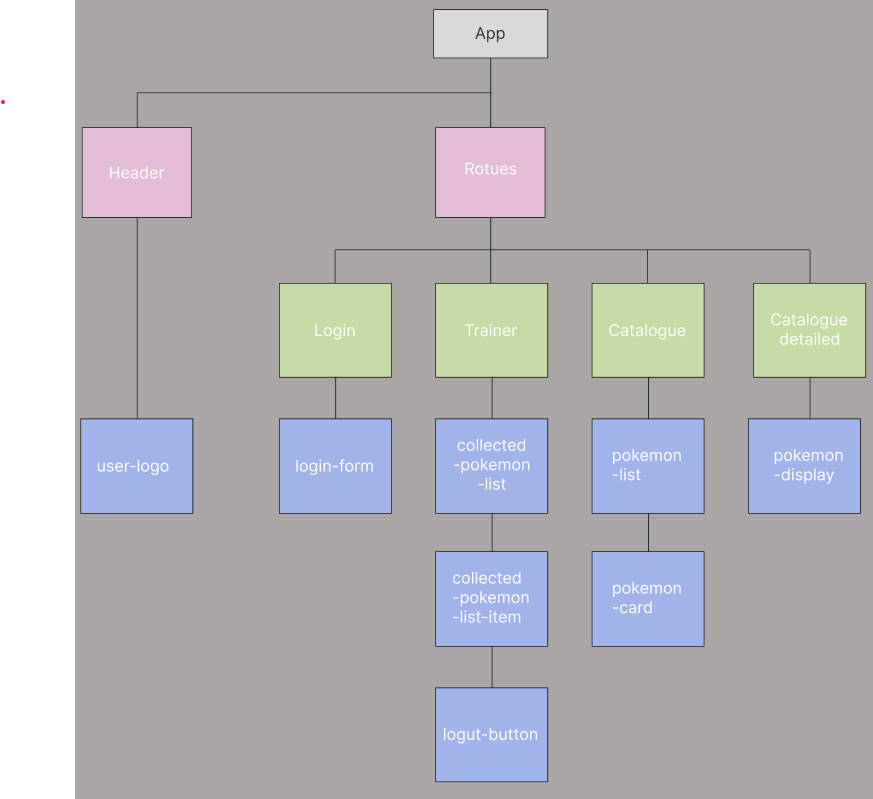

# Pokemon trainer
This is an Pokemon Page, made as a Single Page Application using the Angular Framework. It is also hosted with heroku.

## Contributors
- [Mussa Banjai](https://gitlab.com/MoBanju)
- [Synne Sævik](https://gitlab.com/synnems)
- [Vebjørn Sundal](https://gitlab.com/vebsun95)

## Description
The application have a login, catalogue and trainer page. The login page will take a name as input and login if the name of the trainer is existent, otherwise it will create a new trainer. This is redirected to the trainer page, where the trainer gets to see all the pokemons collected. The trainer can also log out by clicking the button that is available. In catalogue page is a list of pokemons that can be captured. each pokemon has an link that can redirect to a detail page for that specific pokemon, where it describes, for example, the abilities, types, species and so on. Trainer can capture the pokemon by clicking on the button.

## Prototype

## Link
[Heroku]()
