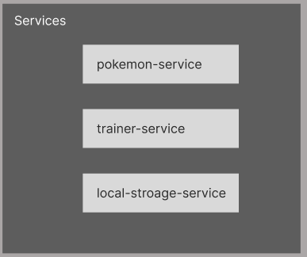

# Pokemon trainer
This is a Pokemon application, made as a Single Page Application using the Angular Framework. It is also hosted with heroku.

## Contributors
- [Mussa Banjai](https://gitlab.com/MoBanju)
- [Synne Sævik](https://gitlab.com/synnems)
- [Vebjørn Sundal](https://gitlab.com/vebsun95)

## Description
The application have a login, catalogue and a trainer page. The login page will take a name as an input, and login if the name of the trainer exists. If not, it will create a new trainer. The trainer is then redirected to the catalogue page, where it is a list of pokemons that can be captured. Each pokemon has a link that can redirect to a detail page for that specific pokemon.  It displays type, abilities, height, weigth and an image. The trainer can capture the pokemon by clicking on the pokeball button. The Trainer page displays the trainer's collection of pokemons, and their details if wanted. The trainer can also release the pokemon. The header contains the trainers name, made as a link to the trainers profile page. It also contains a dropdown with a link to the catalogue and a logout button.

## Prototype

### Component Tree
Changes comparing to the Prototype:
- The logout button has been moved from Trainer Page to the Header

### Services

## Link
[Heroku](https://floating-atoll-81582.herokuapp.com)
